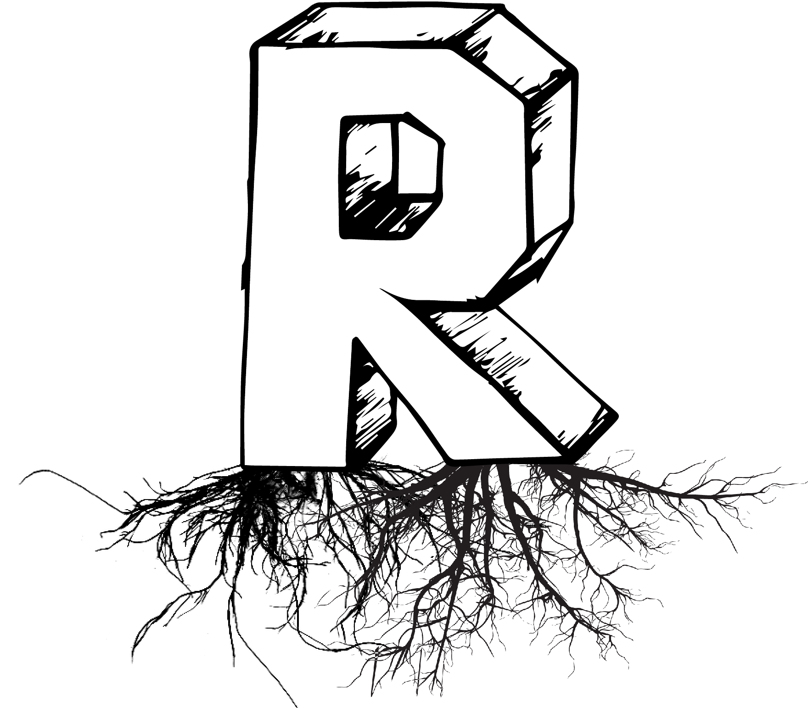

# histoRia - o początkach R w Polsce

## Prezentacja z Trzecich Urodzin SER

[SER_Trzecie_Urodziny](https://github.com/mi2-warsaw/SER/blob/master/histoRia/SER_Trzecie_Urodziny.pdf)

## R w zastosowaniach

* Mapy ICM meteo http://www.meteo.pl/ 2006-2014 Malgorzata Melonek
* Wskaźniki edukacyjnej wartości dodanej (EWD) od 2010 r Tomasz Żółtak i zespół. W latach 2014-2015 powstała docelowa implementacja procesu obliczania tych wskaźników, a także zapewniania dostępu do nich, z wykorzystaniem pakietów R (p. http://ewd.edu.pl/wp-content/uploads/2014/12/poster-id-201513-00544.pdf).

## R w edukacji

W podziale na wydziały

* Na MIM UW przedmiot ,,Symulacje Stochastyczne'' od 2002 Piotr Pokarowski (nie ma R w tytule ale laby były oparte o R)
* Na IM PWr przedmiot ,,Data Mining'' od 2003 Adam Zagdański, Artur Suchwałko (nie ma R w tytule ale laby były oparte o R)
* Na Wydziale Informatyki i Gospodarki Elektronicznej Uniwersytetu Ekonomicznego w Poznaniu -- Przedmioty: Statystyka Matematyczna (2008/2009, dr Marcin Szymkowiak), Wizualizacja i Raportowanie Danych Statystycznych, Real Estate Market Analysis, Geomarketing, Nieklasyczne Metody Analizy Danych w Biznesie, Pakiety Statystyczne (Marcin Szymkowiak, Maciej Beręsewicz), Programowanie w R (Paweł Kliber)
* Na Socjologia UW ,,Analiza sieci społecznych - warsztaty'' 2006 - 2008 (R oraz inne programy)
* Na MiNI PW Statystyka Matematyczna I oraz Computer Statistics z inicjatywy Przemysława Grzegorzewskiego od 2008 
* Osobny kurs o programowaniu w R: Na MIM UW  ,,Programowanie w R i SAS''  od 2010 do 2012 Przemysław Biecek, od 2016 przedmiot nazywa się ,,Programowanie i wizualizacja danych w R''
* Osobny kurs o programowaniu w R: Na MiNI PW przedmiot ,,Programowanie w R''  od 2011 Przemysław Biecek, od 2013 Marek Gągolewski. 

## Polskie konferencje / spotkania

### Spotkania 

W kolejnosci powstania

* WZUR - od 2011 do 2012 - lokalne spotkania
* PAZUR - od 2012 https://www.meetup.com/Poznan-R-User-Group-PAZUR/
* SER - od 2014 http://meetup.com/Spotkania-Entuzjastow-R-Warsaw-R-Users-Group-Meetup/
* eRka - od 2014 http://www.erkakrakow.pl/
* RGUR - od 2016 http://www.wais.kamil.rzeszow.pl/rzeszowska-grupa-uzytkownikow-r/
* R-Ladies od 2016 https://www.facebook.com/RLadiesWarsaw/
* STWUR - od 2017 https://www.meetup.com/Wroclaw-R-Users-Group/
* trigeR - od 2017 https://www.meetup.com/Trojmiejska-Grupa-Entuzjastow-R/ 

### Konferencje

W kolejnosci organizacji

* WZUR - 2008, 2009, 2010 http://biecek.pl/WZUR/ - coroczne konferencje
* Polski Akademicki Zlot Użytkowników R (PAZUR) - 2014 http://www.estymator.ue.poznan.pl/pazur/
* European R Users Meeting (eRum) - 2016 http://erum.ue.poznan.pl/ 
* WhyR - 2017 http://whyr.pl/ 

### Maratony analizy danych

* Maraton Zespołowej Analizy Danych - maj 2015 - Warszawa
* Wakacyjny Maraton Analizy Danych - lipiec 2015 - Kraków
* Maraton Analizy Danych (eRka i Onet.pl) - listopad 2015 - Kraków

## Polskie książki o R

W kolejności publikacji

* Wprowadzenie do środowiska R, Łukasz Komsta, 21 sierpnia 2004 https://cran.r-project.org/doc/contrib/Komsta-Wprowadzenie.pdf
* Ekonometria i statystyka przestrzenna z wykorzystaniem programu R CRAN, Katarzyna Kopczewska, CeDeWu	Warszawa	2006
* Przewodnik po pakiecie R. Autor: Przemysław Biecek, Oficyna Wydawnicza GiS 2008 (wydanie pierwsze), 2011 (wydanie drugie), 2014 (wydanie trzecie), 2017 (wydanie czwarte)
* Wstęp do wielowymiarowej analizy statystycznej zjawisk ekonomicznych. Kurs z wykorzystaniem środowiska R, 2008, Daniel Kosiorowski
* Elementy statystyki małych obszarów z programem R, Żądło, T. (2008), [LINK](http://www.ue.katowice.pl/jednostki/wydawnictwo/oferta-wydawnicza/podreczniki/zadlo-t-elementy-statystyki-malych-obszarow-z-programem-r-2008.html)
* Metody ilościowe w R. Aplikacje ekonomiczne i finansowe, Katarzyna Kopczewska,Tomasz Kopczewski,Piotr Wójcik	CeDeWu	Warszawa	2009	
* Marek Walesiak, Eugeniusz Gatnar, Andrzej Bąk: Statystyczna analiza danych z wykorzystaniem programu R. Warszawa: Wydawnictwo Naukowe PWN, 2009. 
* Statystyczne systemy uczące się. Ćwiczenia w oparciu o pakiet R, 2009 Jan Ćwiek, Jan Mielniczuk, http://www.wydawnictwopw.pl/index.php?s=karta&id=1114
* Analiza danych jakościowych i symbolicznych z wykorzystaniem programu R, 2011, Gatnar Eugeniusz, Walesiak Marek, http://ekonomiczna24.osdw.pl/ksiazka/Analiza-danych-jakosciowych-i-symbolicznych-z-wykorzystaniem-programu-R,54351800106KS
* Analiza danych z programem R. Modele liniowe z efektami stałymi, losowymi i mieszanymi, Autor: Przemysław Biecek, Wydawnictwo Naukowe PWN 2011 (wydanie pierwsze), 2013 (wydanie drugie), 
* Podstawy statystyki z przykładami w R. Autor: Tomasz Górecki, Wydawnictwo BTC 2011, 
* Modelowanie polskiej gospodarki z pakietem R. Autor: Michał Rubaszek, Oficyna Wydawnicza SGH 2012
* Ekonometryczne modelowanie polskiej gospodarki z pakietem R. Autor: Michał Rubaszek, Oficyna Wydawnicza SGH 2012, 
* Receptury w R, Bogumił Kamiński, Mateusz Zawisza, 2012 http://wydawnictwo.sgh.waw.pl/produkty/profilProduktu/id/571/RECEPTURY_W_R_Bogumil_Kaminski_Mateusz_Zawisza/
* Wstęp do statystyki odpornej. Kurs z wykorzystaniem środowiska R, 2012, Daniel Kosiorowski
* Meandry programowania w języku R. B. Borowik, B. Borowik. Bel-Borowik http://bookmaster.com.pl/ksiazka-meandry,programowania,w,jezyku,r-barbara,borowik,bohdan,borowik-998365.xhtml
* Wnioskowanie statystyczne z wykorzystaniem środowiska R, Grzegorzewski P., Gagolewski M., Bobecka-Wesołowska K., 2014
* Programowanie w języku R. Analiza danych, obliczenia, symulacje. Autor: Marek Gągolewski, Wydawnictwo Naukowe PWN 2014 (wydanie pierwsze), 2016 (wydanie drugie poszerzone), 
* Analiza i prognozowanie szeregów czasowych: praktyczne wprowadzenie na podstawie środowiska R. Adam Zagdański, Artur Suchwałko, Wydawnictwo Naukowe PWN, 2016. 
* Geostatystyka W R. Nowosad, Jakub. 2016. https://bookdown.org/nowosad/Geostatystyka/.

